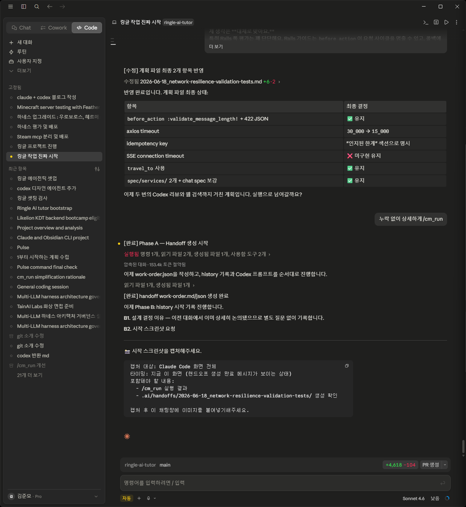
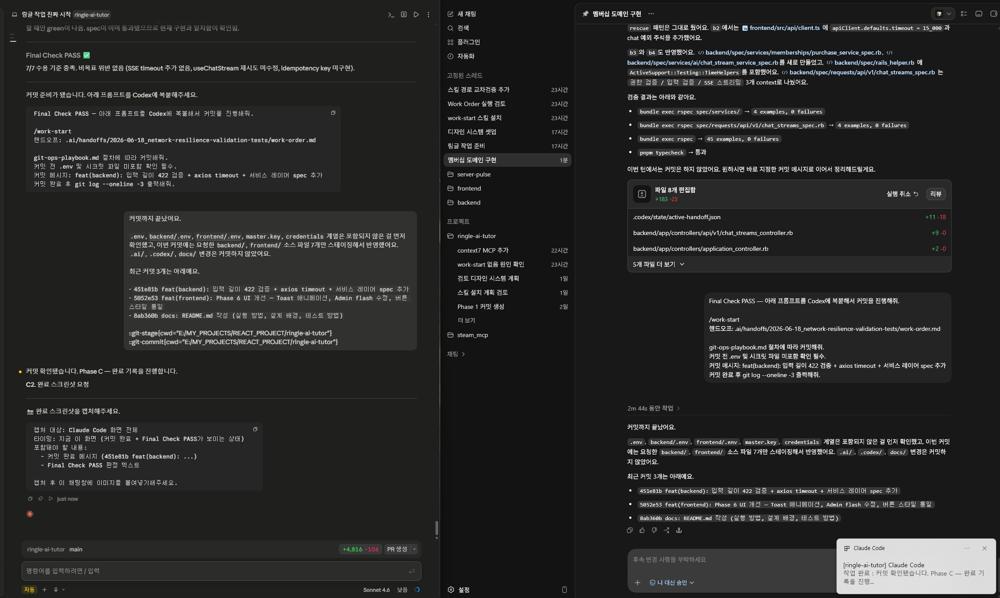
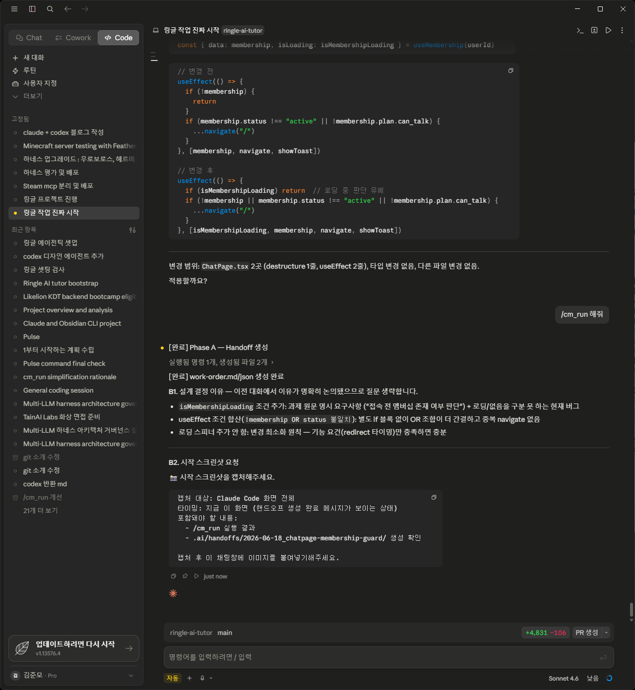
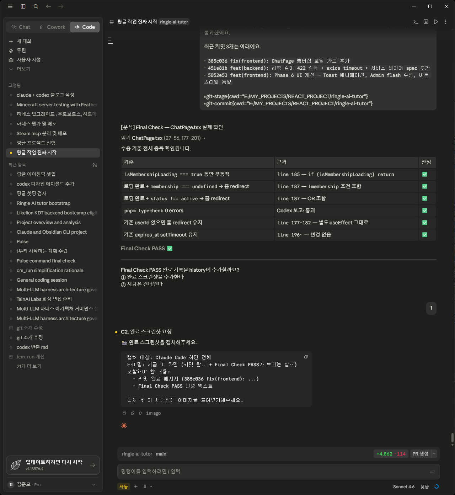
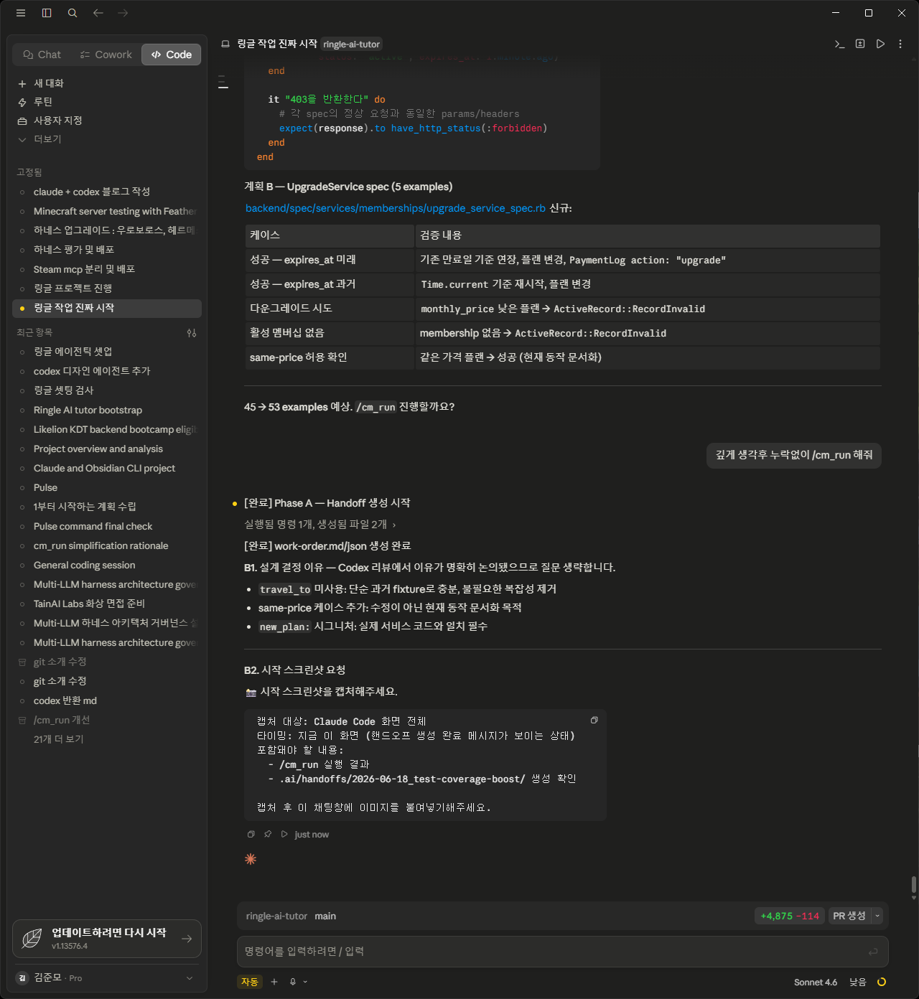
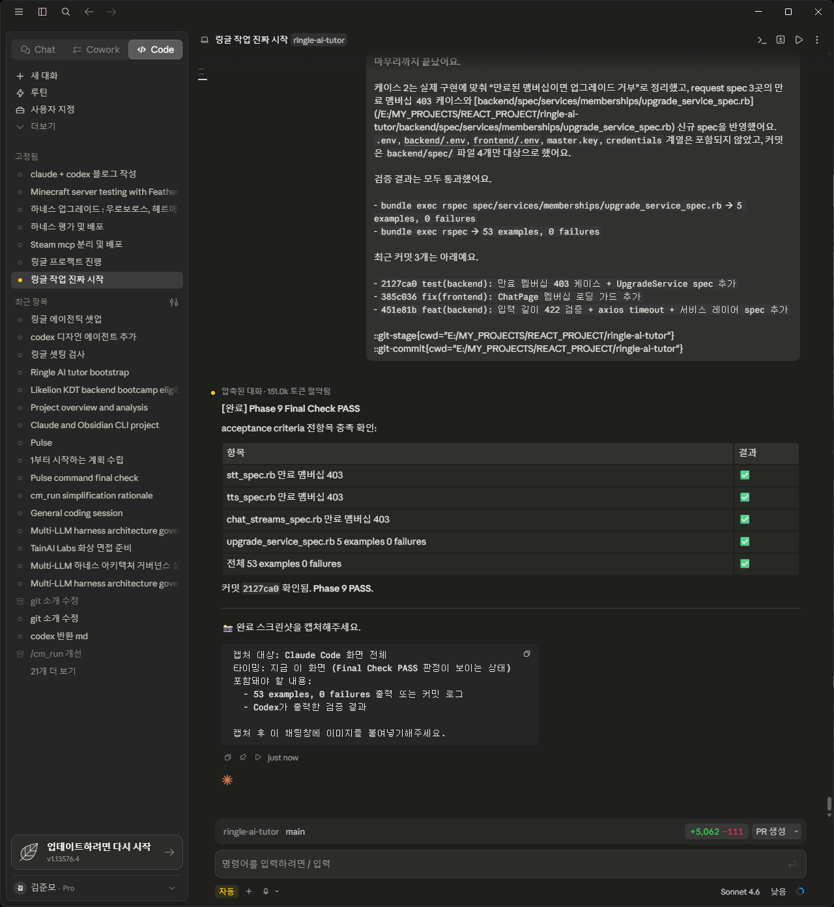
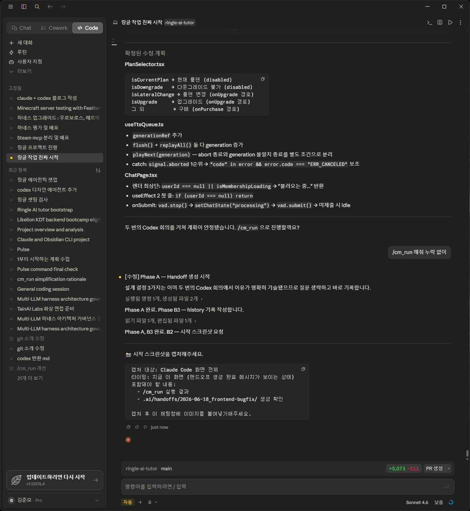
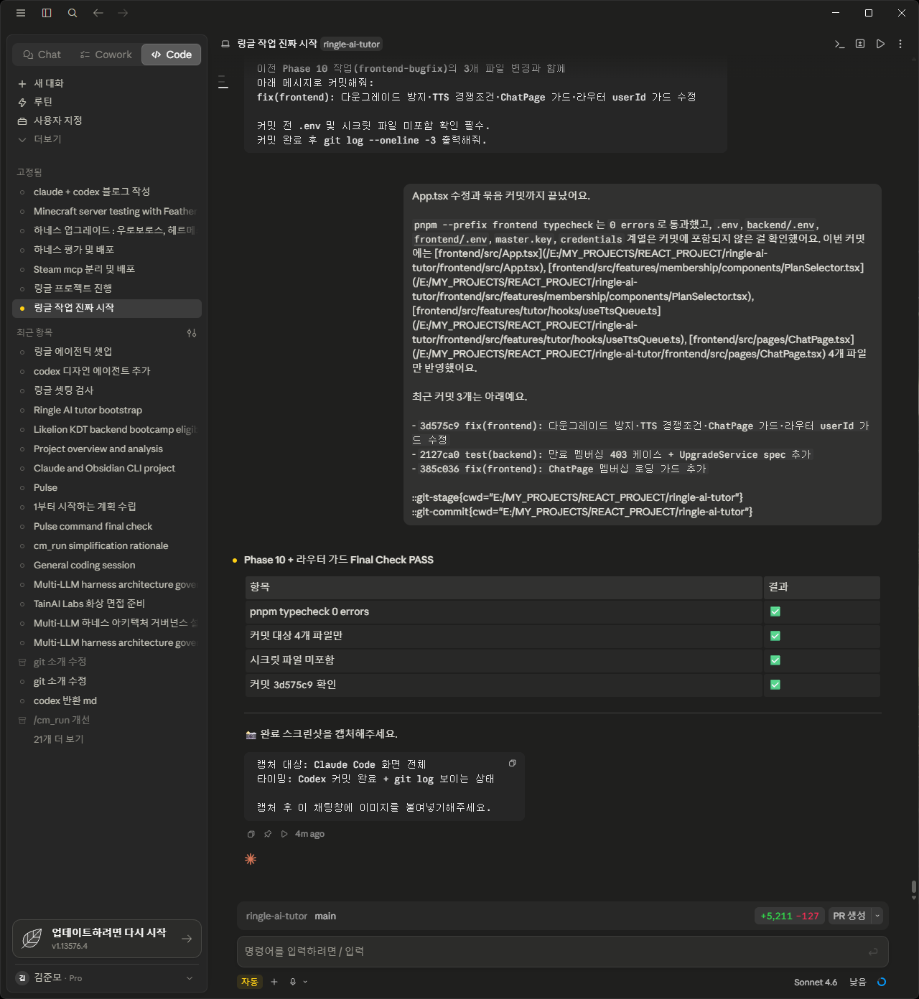
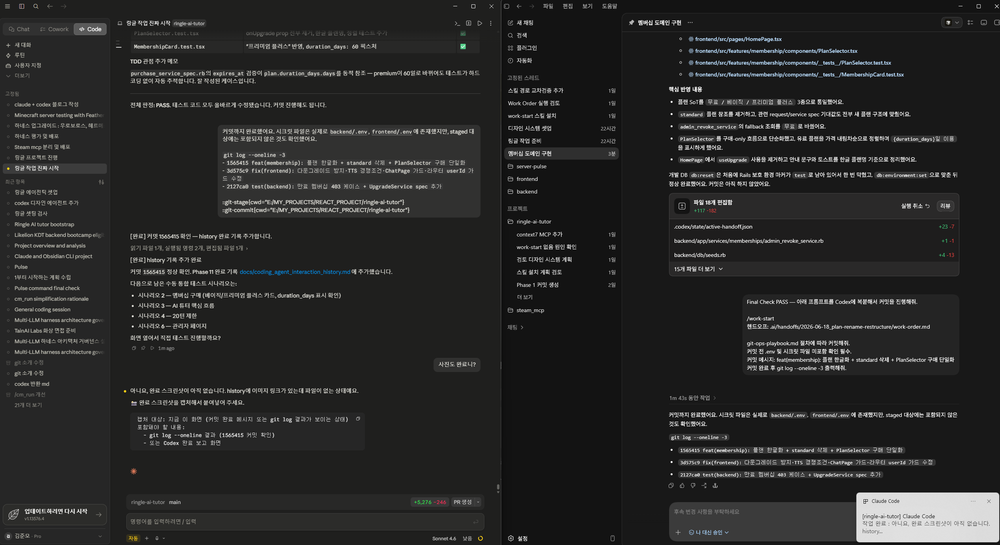

# AI 협업 작업 기록 (Coding Agent Interaction History)

> **이 문서는 과제 제출 필수 산출물입니다.**  
> Claude + Codex + Gemini CLI 협업의 주요 작업 과정을 Phase별 narrative로 기록합니다.  
> 작성 주체: Claude (`/cm_run` 실행 시 자동 갱신)

---

## 문서 사용법

**이 파일**을 읽어 전체 작업 흐름과 설계 결정 이유를 파악합니다.

---

<!-- ================================================================ -->
<!-- 아래부터 Phase별 작업 기록이 /cm_run 실행 시 자동으로 추가됩니다. -->
<!-- ================================================================ -->

---

## Phase — Claude + Codex 하네스 부트스트랩 (2026-06-16)

**태스크 ID:** `ringle-ai-tutor-bootstrap`  
**handoff 파일:** `.ai/handoffs/2026-06-16_ringle-ai-tutor-bootstrap/work-order.md`  
**상태:** completed

### 작업 배경 및 목표

신규 `ringle-ai-tutor` 저장소에 Claude + Codex 멀티 LLM 하네스를 처음부터 설치하는 Phase 0 작업이다.
이전 프로젝트(서버-펄스, Next.js 기반)의 잔재를 이식하지 않고, 단일 저장소 Rails API + React/Vite 기준으로 완전히 재구성하는 것이 목표였다.
Phase 0 범위는 구조·콘텐츠·기능·프로토콜·보안 5개 1차 게이트(A~E) 검증까지였다.

### 주요 프롬프트 예시

> "신규 ringle-ai-tutor 저장소에 Claude + Codex 멀티 LLM 하네스를 설치해줘."  
> — 이전 프로젝트 에셋 미이식, 단일 저장소 기준으로만 재구성 요청

### 설계 결정 이유

| 결정 항목 | 선택 | 이유 |
|---|---|---|
| 이전 에셋 이식 금지 | 완전 재구성 | 다중 저장소 전제·이전 스택 잔재를 가져오면 후속 작업에서 충돌 발생 |
| 2차 게이트(앱 부팅·테스트) 제외 | Phase 1로 이관 | 앱 스캐폴딩 전이므로 부팅 검증 불가. 게이트 범위를 현실에 맞게 분리 |
| Rails API + React/Vite 기준 고정 | 단일 스택 | CLAUDE.md 에 명시된 스택으로 에이전트 설명·플레이북 전면 재작성 |
| pre_tool_policy 훅 설치 | 보안 레이어 우선 | 구현 시작 전에 시크릿 차단·scope 확인·분석-구현 분리 게이트를 먼저 세움 |

### 최종 결과 요약

| 게이트 | 항목 | 결과 |
|---|---|---|
| A (구조) | 필수 디렉토리 8개, Claude 훅 3개+1개, Codex 훅 4개, Guardian 4종 | ✅ 5/5 |
| B (콘텐츠) | 이전 스택 잔재 없음, CLAUDE.md 필수 섹션 존재, INTEGRATION_GATE 문서 완비 | ✅ 6/6 |
| C (기능) | 질문형 차단, 시크릿 패턴 차단, scope 훅 동작, settings.json 훅 경로 일치, config.toml 경로 정상 | ✅ 5/5 |
| D (프로토콜) | active-handoff 갱신 확인, work-order.json 필수 필드, git_state 정의 | ✅ 3/3 |
| E (보안) | .gitignore 필수 항목, 실제 키 패턴 없음, .env 미스테이징, active-handoff 민감정보 없음 | ✅ 4/4 |

- 검증 항목 23/23 PASS
- 커밋 없음 (`.claude/`, `.codex/`, `.ai/` 는 .gitignore 대상)

---

## Phase — Rails API + React/Vite SPA 스캐폴딩 (2026-06-16)

**태스크 ID:** `phase1-scaffold`  
**handoff 파일:** `.ai/handoffs/2026-06-16_phase1-scaffold/work-order.md`  
**상태:** completed

### 작업 배경 및 목표

하네스 부트스트랩(Phase 0) 완료 후 실제 앱 골격을 구축하는 Phase 1 작업이다.
Rails API 서버와 React/Vite SPA 양쪽이 로컬에서 부팅되고, Health check 엔드포인트를 통해 통신 가능한 상태를 목표로 했다.
Ruby 3.3.11, PostgreSQL 16.14, Node v22.21.0, pnpm v10.26.1은 이미 설치된 상태였고, Rails만 신규 설치가 필요했다.

### 주요 프롬프트 예시

> "Phase 1 스캐폴딩 시작해줘"  
> — Phase 0 완료 직후 실제 앱 골격 생성을 요청한 시작점

### 설계 결정 이유

| 결정 항목 | 선택 | 이유 |
|---|---|---|
| AppConfig 초기화 계층 | `config/initializers/app_config.rb` | CLAUDE.md §2-1: 컨트롤러 등 애플리케이션 코드는 직접 ENV 접근 금지 |
| ApplicationController 전역 rescue_from | `rescue_from` 두 개만 | CLAUDE.md §2-5: 각 액션에 begin/rescue 반복 금지, 전역 처리 집중 |
| X-User-Id 헤더 인증 | `set_current_user` before_action | 과제 조건: 실인증 없이 헤더로 사용자 구분 |
| Health check 응답 형식 | `{ data: { status, timestamp, version } }` | CLAUDE.md §2-6: 성공 응답은 `{ data: ... }` 형식 통일 |
| 프론트 환경변수 | `src/config/api.ts` 단일 파일 경유 | CLAUDE.md §4-2: 컴포넌트에서 `import.meta.env` 직접 읽기 금지 |

### 최종 결과 요약

| 항목 | 명령어 | 결과 |
|---|---|---|
| Health check | `curl http://localhost:3000/api/v1/health` | ✅ 200 OK |
| CORS 헤더 | Origin: http://localhost:5173 헤더 확인 | ✅ Access-Control-Allow-Origin 존재 |
| RSpec | `bundle exec rspec` | ✅ 1 example, 0 failures |
| 타입 검사 | `pnpm typecheck` | ✅ 0 errors |
| 프론트 테스트 | `pnpm test` | ✅ 1 passed |

- 완료 기준 5/5 PASS
- git commit: `feat(scaffold): Phase 1 Rails API + Vite SPA 스캐폴딩` (a91c14f 이전 커밋)

---

## Phase — CSS 변수 기반 디자인 시스템 셋업 (2026-06-17)

**태스크 ID:** `design-system-setup`  
**handoff 파일:** `.ai/handoffs/2026-06-17_design-system-setup/work-order.md`  
**상태:** completed

### 작업 배경 및 목표

실제 링글 앱 스크린샷 11장과 구매 페이지를 분석해 도출한 `docs/example/design-spec/design-spec.md`의 디자인 토큰을 CSS 변수로 프로젝트에 녹이는 작업이다.
컴포넌트 구현은 이번 범위가 아니며, 환경 설정(tokens.css + Pretendard 폰트 + 에이전트 경계 설정)만 수행했다.
이후 모든 UI 작업은 `design` 에이전트가 전담하도록 경계를 설정하는 것이 핵심 목표였다.

### 주요 프롬프트 예시

> "디자인 시스템 기반 셋업해줘"  
> — design-spec 도출 완료 후 토큰 → CSS 변수 적용 및 에이전트 경계 설정 요청

### 설계 결정 이유

| 결정 항목 | 선택 | 이유 |
|---|---|---|
| `tokens.css` 별도 파일 분리 | `frontend/src/styles/tokens.css` | index.css와 토큰 정의를 섞으면 에이전트 경계가 모호해짐. import 순서 보장도 필요 |
| Pretendard 폰트 패키지 | `@fontsource/pretendard` | CDN 의존 없이 번들에 폰트 내장. 실제 링글 앱 폰트 패밀리와 일치 |
| `fab-size-vad-max` 제외 | JS 상수로 처리 | 동적 scale 값은 CSS 변수가 아니라 컴포넌트 로직에서 계산해야 함 |
| `design.toml` 에이전트 생성 | `allowed_paths` prefix 기반 | `frontend/src/styles/**`, `frontend/src/components/ui/**` 전담. 컴포넌트 직접 생성 전 보고 의무화 |
| `frontend_orchestrator.toml` 경계 추가 | `style_boundary` 필드 명시 | 오케스트레이터가 design 에이전트 담당 경로를 건드리지 않도록 read-only / write 구분 명시 |

### 최종 결과 요약

| 항목 | 결과 |
|---|---|
| `tokens.css` 생성 (design-spec §1 전체 포함) | ✅ |
| `index.css` — Pretendard import + tokens.css import + 하드코딩 색상 제거 | ✅ |
| `App.tsx` import 경로 `./styles/index.css` 수정 | ✅ |
| `design.toml` 에이전트 생성 (allowed_paths 포함) | ✅ |
| `frontend_orchestrator.toml` style_boundary 추가 | ✅ |
| `pnpm dev` / `pnpm typecheck` / `pnpm build` 에러 없음 | ✅ |

- 수용 기준 11/11 충족
- git commit: `chore(design): 디자인 시스템 기반 셋업 - tokens.css + Pretendard` (a91c14f)

---

## Phase — 스킬 즉시 설치 3개 (2026-06-17)

**태스크 ID:** `2026-06-17_skill-install-3`  
**handoff 파일:** `.ai/handoffs/2026-06-17_skill-install-3/work-order.md`  
**계획 파일:** `.ai/plans/drafts/2026-06-17_skill-adoption.md`

### 작업 배경 및 목표

Codex Work 단계에서 실제 참조할 스킬을 선별해 설치하는 작업이다.
4차례 Codex 리뷰를 거쳐 코드 근거가 확인된 3개(tanstack-query, vitest, ruby-rails)만 즉시 설치하고,
`.codex/config.toml`에 명시 등록해 Codex Work 세션에서 실제 활성화되도록 한다.

### 주요 프롬프트 예시

> "해당 내용 외곡없고 누락 없이 /cm_run 해줘"  
> — 4차 Codex 리뷰까지 완료된 스킬 설치 계획을 핸드오프로 만들어달라는 요청

### 설계 결정 이유

| 결정 항목 | 선택 | 이유 |
|---|---|---|
| 즉시 설치 3개 / 조건부 2개 구분 | 코드 근거 있는 것만 선별 | package.json·Gemfile에 의존성 확인된 3개만 즉시. voice-agents·tailwind는 선행 조건 미충족 |
| 설치 전 config.toml path 고정 금지 | 실제 폴더명 불확실성 | npx skills add 결과 폴더명이 스킬 이름과 다를 수 있음. find-skills 선례는 있으나 3개는 미확정 |
| config.toml 명시 등록을 수용 기준에 추가 | 설치만으로 활성화 안 됨 | .codex/config.toml은 화이트리스트 명시 등록형. 2차 Codex 리뷰에서 확인 |

### 완료 화면

### 최종 결과 요약

| 항목 | 실제 폴더명 | config.toml path | skills-lock.json |
|---|---|---|---|
| tanstack-query | `tanstack-query` | `.agents/skills/tanstack-query` | ✅ 자동 반영 |
| vitest | `vitest` | `.agents/skills/vitest` | ✅ 자동 반영 |
| ruby-rails | `ruby-rails` | `.agents/skills/ruby-rails` | ✅ 자동 반영 |

- 수용 기준 13/13 충족
- 기존 `.agents/skills/` 9개 블록 보존
- git commit 없음 (`.agents/`, `.codex/` 는 .gitignore 대상)

---

## Phase — .codex/ 에이전트 시스템 재설계 (2026-06-17)

**태스크 ID:** `agent-redesign`  
**handoff 파일:** `.ai/handoffs/2026-06-17_agent-redesign/work-order.md`  
**회의 라운드:** Claude 1회 리뷰 + Codex 3차 회의 + Claude 최종 조율

### 작업 배경 및 목표

디자인 시스템 셋업 완료 후 Phase 2 UI 구현 진입 전, 에이전트 체계 전면 점검에서
운영 레이어 미연결·역할 공백·allowed_paths 비호환 등 6개 구조적 문제가 발견됐다.
이를 해소하고 실제 작동하는 에이전트 구조로 재설계하는 것이 목표다.

### 주요 프롬프트 예시

> "이거 CODEX 측에 물어볼꺼 있어? 의견 나누면서 회의 하게 프롬프트 줘봐"  
> — Claude 리뷰 후 Codex와 공동 검토를 요청한 시작점

> "한번더 회의 해보자" (3회 반복)  
> — 각 회의 결과를 반영해 재검토를 거듭하며 결정을 확정한 흐름

> "아주 깊게 생각후 상세하게 계획 세워보고 그다음 /cm_run 해줘"  
> — 3회 회의 완료 후 최종 핸드오프 작성 지시

> "그 테스크랑 coding_agent_interaction_history 반영하는건 왜 없니?"  
> — 이 기록 추가의 직접적인 트리거

### 설계 결정 이유

| 결정 항목 | 선택 | 이유 |
|---|---|---|
| allowed_paths 형식 | glob(`**`) 전부 제거 → trailing slash prefix 통일 | `pre_tool_policy.js`의 `isAllowed()`가 glob 미지원임을 코드 직접 확인 |
| frontend_orchestrator | read-only 유지 + `write_allowed_paths` 제거 | sandbox_mode=read-only와 설정 자기 모순 해소. frontend_feature로 구현 책임 분리 |
| ai_pipeline + chat_runtime | 통합 1개 | AI 코드 미존재 시점에서 분리 기준 없음. 코드 생기면 분리 |
| hooks/ 소유권 | `frontend_feature`에서 제거 → `ai_pipeline`이 prefix 전체 소유 | useVAD/useSSE/useTTS exact match는 미존재 파일이라 영구 차단됨. prefix 유일 해결책 |
| done 이벤트 payload | `{"type":"done","conversation_id":N}` | `turn_count`는 Message 모델 선행 필요 → Phase 2. 설계 문서 불일치는 handoff 우선 |
| B0 active-handoff 갱신 | pre_tool_policy.js 등록 전 첫 단계로 배치 | 등록 후 active-handoff가 구 범위면 B0 나머지 파일 수정이 즉시 차단됨 |
| hooks.json 예시 | partial → full merged 구조로 교체 | 기존 PS1 3개 블록 누락 방지. 구현자가 예시 그대로 쓸 수 있도록 완성형 제공 |
| B2 검증식 | regex → `test ! -f` 8개 직접 확인 | `git-ops.toml`, `github-issue.toml`은 정상 하이픈 파일. regex 오탐 방지 |

### 완료 화면

### 최종 결과 요약

| 배치 | 내용 | 결과 |
|------|------|------|
| B0 | active-handoff 갱신 + hooks.json full merge + session_start_context.js 수정 + design.toml prefix 변환 | ✅ |
| B1 | `.ai/plans/drafts/2026-06-17_codex-agent-redesign.md` 5섹션 작성 | ✅ |
| B2 | 하이픈 중복 에이전트 8개 삭제 (git-ops/github-issue 유지) | ✅ |
| B2.5 | `frontend_orchestrator.toml` `write_allowed_paths` 제거 | ✅ |
| B3 | `frontend_feature.toml` 신규 생성 (hooks/ 제외, prefix 기반) | ✅ |
| B4 | `ai_pipeline.toml` 신규 생성 (hooks/ prefix 소유, SSE 계약 명시) | ✅ |
| B5 | `codex-tdd-playbook.md` Vitest 패턴 + CSS grep + setup 점검 추가 | ✅ |

- 수용 기준 20/20 충족
- Final Check PASS (2026-06-17)
- 커밋 없음 (.codex/, .ai/ gitignored)

---

## Phase 2 — Backend 멤버십 도메인 (2026-06-17)

**태스크 ID:** `2026-06-17_phase2-membership-domain`  
**handoff 파일:** `.ai/handoffs/2026-06-17_phase2-membership-domain/work-order.md`

### 작업 배경 및 목표

Phase 1 스캐폴딩 완료 후 첫 번째 비즈니스 로직 구현 단계다.
AI 파이프라인과 프론트엔드 화면 모두 멤버십 권한 체크에 의존하므로,
DB 마이그레이션 → 모델 → 서비스 객체 → 컨트롤러 → Seed → RSpec 순서로
멤버십 도메인 전체를 Rails 백엔드에 구현하는 것이 목표다.
OpenAI 키 없이 순수 Rails + PostgreSQL만으로 완성 가능한 범위다.

### 주요 프롬프트 예시

> "그럼 준비는 완료 되었고 이제 Phase 2 깊게 읽어보고 깊게 생각해본다음 상세하게 계획 수립하고 /cm_run 해줘 누락, 오해 없이"

### 설계 결정 이유

| 결정 항목 | 선택 | 이유 |
|---|---|---|
| 만료 판단 기준 | expires_at 단일 기준 | 복잡도 제거 — 횟수+기간 이중 기준은 엣지케이스가 많고 과제 요구사항에 명시되지 않음 |
| 어드민 보호 방식 | X-Admin-Key 헤더 | 프론트 연동 편의 — React Axios 인터셉터로 쉽게 처리 가능. 과제에서 인증 제외 범위 |
| 멤버십 없음 응답 | 200 + data:null | 프론트 처리 편의 — 404는 에러 핸들러로 튀지만, 없음은 정상 상태이므로 200으로 통일 |

### 시작 화면

### 완료 화면

### 최종 결과 요약

- 6개 마이그레이션 전부 up (users/plans/memberships/payment_logs/conversations/messages)
- RSpec 28 examples, 0 failures (Membership model spec + 5개 request spec)
- 9개 엔드포인트 정상 라우팅 확인 (일반 6개 + admin 3개)
- 서비스 5개 생성 (MockPaymentService, Purchase/Upgrade/AdminGrant/AdminRevokeService)
- rework_count: 1 (422 Rack deprecation — 심볼 → 숫자 코드로 수정)

---

## Phase 3 — Backend AI Pipeline (2026-06-17)

**태스크 ID:** `2026-06-17_phase3-ai-pipeline`  
**handoff 파일:** `.ai/handoffs/2026-06-17_phase3-ai-pipeline/work-order.md`

### 작업 배경 및 목표

멤버십 도메인(Phase 2) 위에 실제 AI 기능을 올리는 단계다.
STT(Whisper-1), Chat SSE 스트리밍(gpt-4o), TTS(tts-1/nova), 대화 생성/조회 5개 엔드포인트를 구현한다.
Rate Limit(Rack::Attack), 재시도 정책(retryable), 멤버십 can_talk 체크까지 포함한다.
프론트엔드와 연동 전 백엔드 AI 파이프라인 전체를 완성하는 것이 목표다.

### 주요 프롬프트 예시

> "응 깊게 문서 읽어보고 누락, 외곡 없이 아주 상세하게 계획 세워주고 그다음 /cm_run 해줘"

### 설계 결정 이유

| 결정 항목 | 선택 | 이유 |
|---|---|---|
| OpenAI API 테스트 격리 | WebMock 스텁 | OPENAI_API_KEY 없이 CI/로컬 모두 통과. VCR 카세트보다 단순 |
| SSE 구현 방식 | ActionController::Live | Rails 7.1 내장, 외부 의존 없음. Redis/ActionCable 불필요 |
| require_talk_access! 위치 | ApplicationController 헬퍼 | STT/Chat/TTS 3곳 공통 재사용. 컨트롤러마다 중복 금지 |

### 시작 화면

### 완료 화면

### 최종 결과 요약

---

## Phase 4 — Frontend React/TypeScript 전체 구현 (2026-06-18)

**태스크 ID:** `phase4-frontend`  
**handoff 파일:** `.ai/handoffs/2026-06-18_phase4-frontend/work-order.md`

### 작업 배경 및 목표

Phase 1~3에서 Rails 백엔드 전체(멤버십, AI 파이프라인)가 완성됐고, 이제 과제 평가 핵심인 프론트엔드를 구현하는 단계다.  
React 18 + TypeScript + Vite로 홈(`/`), 대화(`/chat`), 어드민(`/admin`), 학습stub(`/learn`) 4개 화면을 완성한다.  
VAD + Waveform + SSE 스트리밍 + TTS 큐 전체 파이프라인을 브라우저에서 연결하는 것이 핵심 목표다.  
"유저 관점의 제품 완성도 최우선"이라는 과제 기준을 충족해야 한다.

### 주요 프롬프트 예시

> "응 4 해당 내용 깊게 읽어보고 깊게 생각후 계획 수립후 /cm_run 해줘"

### 설계 결정 이유

| 결정 항목 | 선택 | 이유 |
|---|---|---|
| POST SSE 수신 방식 | fetch + ReadableStream 수동 파싱 | EventSource는 GET 전용 — conversation_id·message를 body로 보내는 POST 요청에 사용 불가 |
| VAD 오디오 포맷 | Float32Array → WAV 직접 인코딩 | 헤더 44바이트 추가만으로 순수 JS로 변환 가능. webm 인코딩은 별도 라이브러리 필요 |
| 대화 복원 전략 | localStorage + GET /conversations/:id | 새로고침 내성 — 메모리 상태는 새로고침 시 소멸하므로 서버 데이터 재조회로 대화를 복원한다 |

### 시작 화면

### 완료 화면

### 최종 결과 요약

- VAD 초기화, 마이크 권한, 음성 감지 정상 동작
- STT (Whisper-1) → WAV 업로드 → 텍스트 인식 완료
- Chat SSE 스트리밍 → AI 응답 버블 실시간 표시
- TTS (nova 음성) → 음성 자동 재생 완료
- 홈/어드민/대화 3개 화면 전체 수동 테스트 PASS
- 주요 버그 해결: vad-web CJS/Vite 충돌, StrictMode 이중 초기화, mjs 미들웨어 우회 서빙

---

- AI 라우트 5개 정상 등록 (POST stt/chat/tts, POST/GET conversations)
- RSpec 40 examples, 0 failures (WebMock 스텁으로 OpenAI API 격리 완료)
- Rack::Attack rate limit 3개 (STT 10/min, Chat 10/min, TTS 20/min) — `request.get_header("HTTP_X_USER_ID")` 기준
- 서비스 3개 생성 (TranscriptionService, ChatStreamService, TtsService) — retryable 3회 backoff 포함
- TTS 실제 연동 확인: 21KB MP3 다운로드 성공 (nova 음성, tts-1 모델)
- Chat SSE 동작 확인: OpenAI Tier 0 무료 한도(gpt-4o 429) 문제 — 코드 정상, API 크레딧 충전 필요
- rework_count: 0 (Codex 피드백 반영 4개: access_token:, tempfile, Rack::Attack discriminator, test isolation)

---

## Phase 5 — TTS·STT 버그 수정 및 재생 안정화 (2026-06-18)

**작업 형태:** Phase 4 수동 테스트 후 발견된 버그 패치 (Codex 한도 소진 → Claude 직접 수정)

### 작업 배경 및 목표

Phase 4 커밋(`9eb36ba`) 후 실제 AI 대화를 테스트하는 과정에서 6가지 버그가 발견됐다.  
OpenAI API 크레딧 충전($10) 후 STT→Chat SSE→TTS 전체 파이프라인이 동작하는 환경에서 재현·분석·수정했다.

### 발견된 버그 및 수정 내용

| # | 증상 | 근본 원인 | 수정 파일 |
|---|---|---|---|
| 1 | 영어로 말했는데 한국어 텍스트로 표시 | Whisper-1 `language` 파라미터 미설정 → 한국어 OS 환경에서 자동 감지 오류 | `transcription_service.rb` |
| 2 | TTS 소리 간헐적 미재생, 2턴 이후 완전 중단 | `new Audio().play()`가 COOP/COEP 헤더 환경에서 gesture activation 만료 시 `NotAllowedError` throw | `audio.ts` |
| 3 | 재생 버튼 클릭 시 1~2분 뒤 소리 나옴 | `getBlobUrl(message.content)` key 불일치 — `blobUrlMapRef`는 문장 단위 key, 재생 버튼은 전체 content key로 조회 → miss → 전체 텍스트 TTS 재요청 | `useTtsQueue.ts`, `ChatPage.tsx` |
| 4 | 페이지 진입 시 AI 첫 인사 TTS가 2번 재생 | React StrictMode 이중 useEffect 실행 + `initializeConversation`에 중복 실행 guard 없음 | `ChatPage.tsx` |
| 5 | flush() 호출 시 진행 중인 HTTP 요청이 취소 안 됨 | `fetchTts`에 `AbortSignal`을 전달하지 않아 axios 요청이 계속 진행됨 | `api.ts`, `useTtsQueue.ts` |
| 6 | 답변 완료 버튼 클릭 후 마이크가 켜진 채 유지 | `onSubmit` 핸들러에서 `vad.stop()` 미호출 | `ChatPage.tsx` |

### 설계 결정 이유

| 결정 항목 | 선택 | 이유 |
|---|---|---|
| TTS 재생 방식 교체 | `new Audio()` → `AudioContext` singleton | COOP/COEP(`Cross-Origin-Embedder-Policy: require-corp`) 헤더가 걸린 환경에서 `new Audio().play()`는 gesture activation 만료 시 실패. AudioContext는 한 번 `resume()` 되면 이후 gesture 없이도 계속 재생 가능 |
| Blob 캐시 구조 | `text → objectURL` → `text → Blob` 직접 저장 | objectURL은 revoke 후 무효화되어 재생 버튼에서 재사용 불가. Blob 자체를 보관하면 `playAudioBlob()` 재호출 시 API 재요청 없이 즉시 재생 |
| `isInitializingRef` guard | `useCallback` 내부에 ref guard 삽입 | StrictMode unmount-remount 사이에 두 번째 호출이 들어올 때 API 중복 호출 방지. cleanup 함수의 `cancelled` 플래그와 이중 방어 |

### 주요 프롬프트 예시

> "지금 문제가 있어... 영어로 답했는데 한국어로 나의 채팅이 올라와. 그리고 TTS 가 나올 때가 있고 안나올 때가 있어. 깊게 생각해보고 답해줘"

> "두 번째 AI 답변에서 재생 버튼 누르면 소리가 엄청 늦게 나와 (약 1~2분 뒤). 깊게 생각해보고 이유 찾아봐줘"

### 최종 결과 요약

- STT: `language: "en"` 고정 → 영어 발화가 영어 텍스트로 올바르게 인식
- TTS 자동 재생: AudioContext 기반으로 안정적 재생 (2턴 이후도 정상)
- 재생 버튼: `sentences[]` 단위로 Blob 캐시 hit → API 재호출 없이 즉시 재생
- StrictMode 중복 재생 제거: `isInitializingRef` + `cancelled` 이중 guard
- flush 시 HTTP 요청 실제 취소: `AbortSignal`을 `fetchTts` axios 요청에 전달
- 답변 완료 시 마이크 자동 off

---

## Phase 6 — UI 개선 (2026-06-18)

**작업 형태:** Phase 5 수동 테스트 후 UX 개선 항목 직접 수정 (Claude 직접)

### 작업 배경 및 목표

Phase 5 버그 수정 완료 후 사용자 수동 테스트 중 발견한 UX 문제 8개를 수정한다.  
홈 화면·어드민 화면·전역 Toast 3개 영역에 걸쳐 클릭 흐름과 피드백 일관성을 개선하는 것이 목표다.

### 주요 프롬프트 예시

> "대화 시작 버튼은 플랜이 없거나 basic 이어도 클릭 가능하게 하고 대신 알람 팝업으로 불가능 하다는걸 알려주는게 좋을거 같아."

> "키 입력 잘못 되어도 관리화면 열기를 클릭하면 잠시 다른 화면이 빤짝 비췄다가 돌아온다. 해당 페이지 그대로 있으면서 거절 했으면 좋겠다."

> "토스트가 스르륵 나왔다가 스르륵 사라졌으면 좋겠다 (선입 선출 순서로 사라지면서 한칸씩 내려옴)."

### 수정 항목

| # | 위치 | 문제 | 수정 내용 |
|---|---|---|---|
| 1 | `HomePage.tsx` | "대화 시작" `disabled={!canTalk}` → 클릭 불가, toast가 뜨지 않음 | `disabled={false}` 고정 — onClick 핸들러가 이미 toast 처리 |
| 2 | `PlanSelector.tsx` | Basic 구매 버튼이 `color-surface-subtle` 배경으로 업그레이드 버튼과 디자인 불일치 | 구매 버튼도 `color-primary` 배경으로 통일 |
| 3 | `AdminPage.tsx` | 잘못된 키 입력 후 "관리 화면 열기" 클릭 시 관리 화면이 flash | `isAdminLoading` 추가 — 쿼리 pending 중에는 키 입력 화면 유지 |
| 4 | `AdminPage.tsx` | 로딩 중 버튼 상태 없음 | "관리 화면 열기" 버튼 loading 중 "확인 중..." 텍스트 + disabled |
| 5 | `AdminPage.tsx` | "키 초기화" 클릭 후 input 필드가 초기화되지 않아 즉시 재진입 가능 | `setAdminKeyInput("")` 추가 |
| 6 | `UserMembershipTable.tsx` | 부여 버튼이 현재 플랜과 일치해도 구분 없음 | `plan.name === user.membership?.plan_name` 비교 → `color-primary` 강조 |
| 7 | `UserMembershipTable.tsx` | 현재 멤버십·만료일 컬럼 좌측 정렬, 부여 컬럼 헤더·내용 좌측 정렬 | 해당 컬럼 th/td 모두 `textAlign: "center"` |
| 8 | `Toast.tsx` | 즉각 출현·소멸, 애니메이션 없음 | `toast-slide-in` / `toast-slide-out` keyframe + `exiting` 상태로 FIFO 슬라이드 애니메이션 |

### 설계 결정 이유

| 결정 항목 | 선택 | 이유 |
|---|---|---|
| Admin flash 해결 방식 | `!adminKey \|\| isAdminLoading` 조건으로 키 입력 화면 유지 | 별도 `isAuthenticated` 상태를 추가하면 3개 state가 필요하고 동기화 오류 위험. TanStack Query의 `isLoading`을 직접 활용하는 것이 가장 단순 |
| Toast 애니메이션 구현 방식 | `<style>` 태그 + CSS `@keyframes` 인라인 주입 | 이 프로젝트는 CSS 모듈 미사용, Tailwind 없음. 인라인 keyframes 주입이 추가 의존성 없이 기존 스타일 패턴과 일관됨 |
| 부여 버튼 현재 플랜 비교 기준 | `plan_name` 문자열 비교 | `AdminMembershipSchema`에 `plan_id`가 없고 `plan_name`만 노출됨. API 응답 변경 없이 프론트만으로 해결 |

### 최종 결과 요약

- 수정 파일: `HomePage.tsx`, `PlanSelector.tsx`, `AdminPage.tsx`, `UserMembershipTable.tsx`, `Toast.tsx` (5개)
- `pnpm typecheck` 0 errors 확인
- 수정 항목 8/8 완료

---

## Phase 7 — 네트워크 복원력 보강 및 서비스 레이어 검증 테스트 (2026-06-18)

**태스크 ID:** `2026-06-18_network-resilience-validation-tests`  
**handoff 파일:** `.ai/handoffs/2026-06-18_network-resilience-validation-tests/work-order.md`

### 작업 배경 및 목표

Phase 1~6에서 AI 파이프라인·멤버십·프론트엔드 기능 구현이 완료됐지만, 네트워크 오류 처리와 서비스 레이어 테스트가 미비했다.  
사용자 입력이 2000자를 초과하거나 axios 요청이 무한 대기할 때의 방어 로직이 없었고,  
`PurchaseService`·`ChatStreamService` 등 핵심 서비스에 단위 테스트가 존재하지 않았다.  
이 Phase에서는 422 입력 검증, axios timeout 설정, 서비스 spec 2개 신규 작성, chat request spec context 분리를 수행한다.

### 주요 프롬프트 예시

> "네트워크 오류도 최대한 보완했으면 좋겠어 깊게 생각후 계획 한번 세워봐"

> "현업에서 2026-06 기준 사용하는거 웹에서 한번 모범사례 찾아봄다음 추가 및 보완할거 한번 찾아서 중립 잘 지켜서 깊게 생각후 다시정리해줘"

> "누락 없이 상세하게 /cm_run"

### 설계 결정 이유

| 결정 항목 | 선택 | 이유 |
|---|---|---|
| SSE connection timeout 제거 | timeout 미추가 | `Message.create!`가 AI 호출 전에 실행되므로, SSE 재시도 시 중복 메시지 생성 위험. 정상 요청도 첫 바이트 전에 timeout 오탐 가능 |
| axios timeout 30s → 15s | `15_000`ms | 2026-06 현업 기준 일반 REST API는 10~15s가 표준. 30s는 대용량 보고서 생성 등 heavy operation용. chat은 fetch 기반이므로 미적용 |
| idempotency key 미구현 | 과제 범위 제외 | 기존 `useChatStream.ts` 3회 재시도와 `Message.create!` 중복 위험이 공존하지만, idempotency key 구현은 과제 범위를 초과함. "인지된 한계"로 명시 |

### 시작 화면

### 완료 화면

### 최종 결과 요약

| 항목 | 결과 |
|---|---|
| `validate_message_length!` before_action + 422 JSON | ✅ |
| `apiClient.defaults.timeout = 15_000` | ✅ |
| `spec/services/memberships/purchase_service_spec.rb` 신규 (2 examples) | ✅ |
| `spec/services/ai/chat_stream_service_spec.rb` 신규 (2 examples) | ✅ |
| `chat_streams_spec.rb` context 3종 분리 + 입력 검증 422 케이스 | ✅ |
| `bundle exec rspec` 45 examples, 0 failures | ✅ |
| `pnpm typecheck` 0 errors | ✅ |
| 커밋: `451e81b feat(backend): 입력 길이 422 검증 + axios timeout + 서비스 레이어 spec 추가` | ✅ |

---

## Phase 8 — ChatPage 멤버십 접근 가드 수정 (2026-06-18)

**태스크 ID:** `2026-06-18_chatpage-membership-guard`  
**handoff 파일:** `.ai/handoffs/2026-06-18_chatpage-membership-guard/work-order.md`

### 작업 배경 및 목표

과제 원문에 "유저가 대화 화면에 접속하기 전에 멤버십의 존재 여부를 판단합니다."라고 명시되어 있으나, 기존 `ChatPage.tsx`는 `useMembership` 로딩 중(`membership === undefined`)일 때 체크를 건너뛰어 대화 화면이 일시적으로 렌더링되는 문제가 있었다.  
`isMembershipLoading` 상태를 활용해 로딩 중에는 판단을 유예하고, 로딩 완료 후 멤버십이 없거나 권한이 없으면 홈으로 redirect하도록 수정한다.

### 주요 프롬프트 예시

> "과제 원문 기준 최종 대조 결과 — ChatPage 진입 전 로딩 가드 없음이 미흡 항목으로 확인됨. 1 하고 /cm_run 해줘"

### 설계 결정 이유

| 결정 항목 | 선택 | 이유 |
|---|---|---|
| `isMembershipLoading` 조건 추가 | useEffect 첫 줄 guard | 로딩 중과 데이터 없음을 구분해야 과제 요건(접속 전 판단) 충족 가능 |
| `!membership OR status 불일치` OR 조합 | 단일 if 조건 | 별도 if 블록 없이 중복 navigate 없이 간결하게 처리 가능 |
| 로딩 스피너 UI 추가 안 함 | 기존 Layout 유지 | 변경 최소화 원칙 — redirect 타이밍 수정만으로 과제 요건 충족 |

### 시작 화면

### 완료 화면

### 최종 결과 요약

| 항목 | 결과 |
|---|---|
| `isMembershipLoading === true` 동안 membership 체크 유예 | ✅ |
| 로딩 완료 + `membership === undefined` → 홈 redirect | ✅ |
| 로딩 완료 + `status !== active` / `can_talk` 없음 → 홈 redirect | ✅ |
| `pnpm typecheck` 0 errors | ✅ |
| 기존 userId 가드 / expires_at setTimeout 동작 유지 | ✅ |
| 커밋: `385c036 fix(frontend): ChatPage 멤버십 로딩 가드 추가` | ✅ |

---

## Phase 9 — 테스트 커버리지 보강 (2026-06-18)

**태스크 ID:** `2026-06-18_test-coverage-boost`  
**handoff 파일:** `.ai/handoffs/2026-06-18_test-coverage-boost/work-order.md`

### 작업 배경 및 목표

과제 필수 요건 "퀄리티 있는 테스트 코드 반드시 작성"에 맞춰 누락된 2개 영역을 보완한다.  
Codex 리뷰를 통해 (1) 만료 멤버십 request 레벨 검증 누락, (2) UpgradeService 서비스 spec 미작성이 확인됐다.  
`base_time = [expires_at, Time.current].max` 분기 로직과 same-price 허용 동작을 테스트로 문서화한다.

### 주요 프롬프트 예시

> "테스트 코드 부족한거 없니? 깊게 생각하고 실제 내용 확인해줘"

> "한번 codex 한테 질의 해보자 /codex-assist-plan 처럼"

> "깊게 생각후 누락없이 /cm_run 해줘"

### 설계 결정 이유

| 결정 항목 | 선택 | 이유 |
|---|---|---|
| `travel_to` 미사용 | `expires_at: 1.minute.ago` 직접 fixture | 시간 흐름 시뮬레이션 불필요. 단순 과거값으로 충분하고 복잡성 제거 |
| same-price 케이스 추가 | 성공으로 고정 (소스 수정 없음) | 정책 수정은 scope 초과. 현재 허용 동작을 테스트로 문서화하는 것이 목적 |
| `new_plan:` 시그니처 | Codex 지적 채택 | `UpgradeService.initialize`의 실제 파라미터명이 `new_plan:`. `plan:`으로 쓰면 런타임 오류 |

### 시작 화면

### 완료 화면

### 최종 결과 요약

- `backend/spec/requests/api/v1/stt_spec.rb` — 만료 멤버십 403 케이스 추가 ✅
- `backend/spec/requests/api/v1/tts_spec.rb` — 만료 멤버십 403 케이스 추가 ✅
- `backend/spec/requests/api/v1/chat_streams_spec.rb` — 만료 멤버십 403 케이스 추가 ✅
- `backend/spec/services/memberships/upgrade_service_spec.rb` — 신규 5 examples (Case 2는 핸드오프 오류 수정: expires_at 과거 → RecordInvalid로 변경) ✅
- `bundle exec rspec` 전체 53 examples, 0 failures ✅
- 커밋: `2127ca0 test(backend): 만료 멤버십 403 케이스 + UpgradeService spec 추가`

---

## Phase 10 — 프론트엔드 버그 7개 수정 (2026-06-18)

**태스크 ID:** `2026-06-18_frontend-bugfix`  
**handoff 파일:** `.ai/handoffs/2026-06-18_frontend-bugfix/work-order.md`

### 작업 배경 및 목표

수동 통합 테스트 중 발견된 프론트엔드 버그 7개를 수정한다.  
다운그레이드 방지 미작동, TTS 재생 밀림, ChatPage 중복 토스트/플리커/즉시 종료 미작동이 주요 대상이다.  
두 번의 Codex 리뷰를 거쳐 generation counter, 분기 우선순위, stop() 순서 변경을 최종 확정했다.

### 주요 프롬프트 예시

> "전체적으로 개선 했으면 좋겠어 한번에 처리해줘 깊게 생각하고 각각마다 깊게 생각하고 탐색해보면서 해결책 생각해보고 상세하게 계획 세워봐"

### 설계 결정 이유

| 결정 항목 | 선택 | 이유 |
|---|---|---|
| generation counter 패턴 | flush + replayAll 둘 다 generation 증가, playNext에서 abort/generation 분리 체크 | Codex 1차 리뷰: replayAll도 race 동일 적용. 2차 리뷰: abort와 generation을 다른 종료 이유로 코드에서 분리해야 디버깅 가능 |
| PlanSelector 분기 우선순위 명시 | isCurrentPlan → isDowngrade → isLateralChange → isUpgrade → 구매 | Codex 1차 리뷰: isLateralChange를 isUpgrade 뒤에 두면 same-price가 구매로 빠질 수 있음. 명시적 순서로 실수 방지 |
| B-7 onSubmit 순서 | vad.stop() 먼저 → setChatState("processing") → vad.submit() | Codex 1차 리뷰 B안 채택. idle → processing 깜빡임 방지. 미제출 시만 idle 복귀 |

### 시작 화면

### 완료 화면

### 최종 결과 요약

- `PlanSelector.tsx` — isDowngrade(다운그레이드 불가) + isLateralChange(플랜 변경) 분기 추가, 우선순위 명시 ✅
- `useTtsQueue.ts` — generationRef 기반 race condition 수정, abort/ERR_CANCELED 토스트 미출력 ✅
- `ChatPage.tsx` — userId null 가드, 불러오는 중 렌더, onSubmit stop() 순서 수정 ✅
- `App.tsx` — /chat 라우터 레벨 userId 가드 추가 (플리커 원천 차단) ✅
- `pnpm typecheck` 0 errors ✅
- 커밋: `3d575c9 fix(frontend): 다운그레이드 방지·TTS 경쟁조건·ChatPage 가드·라우터 userId 가드 수정`

---

## Phase 11 — 플랜 한글화 + standard 삭제 + PlanSelector 구매 단일화 (2026-06-18)

**태스크 ID:** `2026-06-18_plan-rename-restructure`
**handoff 파일:** `.ai/handoffs/2026-06-18_plan-rename-restructure/work-order.md`

### 작업 배경 및 목표

과제 요구사항과 실제 구현의 불일치를 해소하는 작업. 플랜 이름이 영문(free/basic/standard/premium)으로 돼 있고 standard 플랜이 존재했으나, 요구사항은 한글 3종(무료/베이직/프리미엄 플러스)만 명시. PlanSelector의 업그레이드/다운그레이드 분기도 제거하고 "구매" 단일 흐름으로 단순화. 3회 Codex 리뷰(계획 초안 → work-order → 판정 검증)로 계획을 보완 후 구현.

### 주요 프롬프트 예시

> "free도 '무료'로 해주고 전체적으로 깊게 생각하고 한번 계획 잡아봐 → /cm_run 진행해줘"

### 설계 결정 이유

| 결정 항목 | 선택 | 이유 |
|---|---|---|
| memberships_spec 상단 let 이름 | `basic_plan` (premium_plan 대신) | 상단을 premium_plan으로 하면 upgrade describe 내 let과 이름 겹침 + "같은 플랜으로 업그레이드" 논리 오류 발생. 3차 Codex 리뷰에서 발견 |
| db 갱신 전략 | `rails db:reset` (replant 대신) | replant는 FK truncate 순서 미보장. 2차 리뷰에서 지적. 실제로 환경 마커 문제로 막혀 `db:environment:set` 후 처리 |
| useUpgrade export | hook export 유지, HomePage import만 제거 | API 엔드포인트 변경 비목표. 3차 리뷰에서 명시적으로 정책 확정 |
| duration_days 타입 | optional → 필수(z.number()) | 화면에 "undefined일" 렌더 위험. 1차 리뷰에서 발견 |

### 완료 화면

### 최종 결과 요약

- 플랜 3종 DB 반영: `무료 / 베이직 / 프리미엄 플러스` ✅
- `admin_revoke_service.rb` "free" → "무료" 동기화 (런타임 오류 방지) ✅
- `PlanSelector.tsx` — onUpgrade 제거, 구매 단일, 내림차순 정렬, duration_days 표시 ✅
- `HomePage.tsx` — useUpgrade 제거, 토스트·설명 문구 한글 플랜명 정합 ✅
- `PlanSelector.test.tsx` — 전면 재작성, 4개 케이스 (현재플랜/구매/정렬/콜백) ✅
- `bundle exec rspec` 53 examples, 0 failures ✅
- `pnpm typecheck` 0 errors ✅
- `pnpm test` 7 files, 17 tests passed ✅
- 커밋: `1565415 feat(membership): 플랜 한글화 + standard 삭제 + PlanSelector 구매 단일화`

---

## Phase 12 — 네비게이션 대화 메뉴 멤버십 가드 (2026-06-18)

**태스크 ID:** `2026-06-18_nav-chat-guard`  
**handoff 파일:** `.ai/handoffs/2026-06-18_nav-chat-guard/work-order.md`

### 작업 배경 및 목표

상단 네비게이션의 "대화" 메뉴가 멤버십 등급에 관계없이 항상 노출되어 있어, `can_talk` 플랜이 없는 사용자가 진입 후 403/토스트 에러를 만나는 문제가 있었다.  
진입 전에 메뉴 자체를 숨겨 불필요한 혼란을 제거하고, UX를 개선하는 것이 목표이다.

### 주요 프롬프트 예시

> "상단에 '홈, 대화, 학습, 어드민' 에서의 대화부분만 멤버십 등급에 따라 보이고 안보이는거지"

### 설계 결정 이유

| 결정 항목 | 선택 | 이유 |
|---|---|---|
| 대화 메뉴 처리 방식 | 숨김(conditional render) | 사용자 명시: "보이고 안보이는 것" |
| 멤버십 조회 위치 | Layout.tsx 내부 | nav를 직접 렌더하는 컴포넌트에서 처리가 자연스러움 |
| 로딩 중 처리 | 숨김 | 로딩 완료 전 메뉴가 잠깐 보였다 사라지는 깜빡임 방지 |

### 시작 화면

> 완료 화면은 Final Check PASS 후 추가됩니다.

---

## Phase 13 — serialize_membership plan 필드 누락 수정 (2026-06-18)

**태스크 ID:** `2026-06-18_serialize-membership-fix`  
**handoff 파일:** `.ai/handoffs/2026-06-18_serialize-membership-fix/work-order.md`

### 작업 배경 및 목표

Codex 리뷰를 통해 두 컨트롤러의 `serialize_membership`이 프론트 `PlanSchema` 필수 필드와 불일치함을 발견했다.  
`memberships_controller`는 `duration_days` 누락, `admin/memberships_controller`는 plan 필드 5개 누락.  
Zod parse 실패로 구매 성공임에도 "구매 실패" 토스트가 뜨는 문제를 수정한다.

### 주요 프롬프트 예시

> "왜 구매 실패했다는 토스트가 뜨고 맴버십 변화가 없을까? 깊게 확인해보고 깊게 생각후 답변해줘"

### 설계 결정 이유

| 결정 항목 | 선택 | 이유 |
|---|---|---|
| serialize_membership 공통화 여부 | 각 컨트롤러 개별 수정 | 공통화는 리팩터 범위, 지금은 필드 누락 버그픽스가 목적 |
| admin plan 필드 범위 | 일반 memberships_controller와 동일하게 맞춤 | PlanSchema 재사용 가능하도록 동기화 |

### 시작 화면

### 완료 화면

### 최종 결과 요약

- `memberships_controller.rb` serialize_membership plan에 `duration_days` 추가 ✅
- `admin/memberships_controller.rb` serialize_membership plan에 5개 필드 추가 ✅
- `bundle exec rspec` 14 examples, 0 failures ✅
- 구매/업그레이드 성공 시 Zod parse 실패 → "구매 실패" 토스트 오동작 해결

---

## Phase 14 — Waveform idle 상태 수평선 표시 (2026-06-18)

**태스크 ID:** `2026-06-18_waveform-idle`  
**handoff 파일:** `.ai/handoffs/2026-06-18_waveform-idle/work-order.md`

### 작업 배경 및 목표

ChatPage 진입 시 Waveform canvas가 완전히 비어 있어 어떤 영역인지 구분이 어려웠다.
idle 상태에서 canvas 중앙에 수평 직선을 그려 음성 파형 영역임을 시각적으로 안내한다.

### 주요 프롬프트 예시

> "http://localhost:5173/chat 에서 밑에 음성 나오면 표시해주는거 화면 처음 들어오면 기본으로 주파수 모양으로 지그제그 되어 있으면 안됌?"

### 설계 결정 이유

| 결정 항목 | 선택 | 이유 |
|---|---|---|
| idle 표현 방식 | 수평 직선 | 애니메이션 없는 단순 flat line이 "대기 중" 상태를 직관적으로 표현 |
| idle 색상 | `var(--color-border)` | 비활성 상태임을 primary 색상과 구분 |
| 구현 위치 | 기존 useEffect 내 early return 전 | 별도 effect 분리 없이 최소 변경 |

### 시작 화면

### 완료 화면

### 최종 결과 요약

- `Waveform.tsx` — idle 상태 수평선 렌더 추가, dead code 제거 ✅
- `pnpm typecheck` 0 errors ✅
- ChatPage 첫 진입 시 canvas 중앙에 수평선이 표시되어 영역 인지 가능

---

## Phase 15 — 어드민 멤버십 테이블 UX 개선 (2026-06-18)

**태스크 ID:** `2026-06-18_admin-table-ux`  
**handoff 파일:** `.ai/handoffs/2026-06-18_admin-table-ux/work-order.md`

### 작업 배경 및 목표

`/admin` 멤버십 관리 테이블에서 헤더 정렬이 일부만 center이고 일부는 left인 불일치 문제,
"삭제" 컬럼명이 무엇을 삭제하는지 불명확한 문제,
그리고 멤버십 없는 유저에게 "없음" 대신 "무료"로 표시해 상태를 더 명확히 하는 세 가지 UX 개선 작업.

### 주요 프롬프트 예시

> "어드민 멤버십 관리 그리드에서 상단 컬럼명들은 전부 중앙으로 가게 해주고 삭제 컬럼명은 멤버십 삭제 로 해줘. A 로 하고 삭제 되면 현재 멤버십은 없음이 아니라 무료가 되게 해줘"

### 설계 결정 이유

| 결정 항목 | 선택 | 이유 |
|---|---|---|
| 헤더 정렬 방향 | 전체 center | 기존 일부 left/center 혼재 → 시각 일관성 |
| 컬럼명 변경 | "삭제" → "멤버십 삭제" | 삭제 대상이 유저가 아님을 명확히 |
| 폴백 텍스트 | "없음" → "무료" | 멤버십이 없어도 "무료 플랜" 상태임을 UI에 반영 |

### 시작 화면

> 완료 화면은 Final Check PASS 후 추가됩니다.

---

## Phase 16 — 결제 팝업 모달 + PG 교체 레이어 + 대화 시작 업그레이드 팝업 (2026-06-18)

**태스크 ID:** `2026-06-18_payment-modal-ux`  
**handoff 파일:** `.ai/handoffs/2026-06-18_payment-modal-ux/work-order.md`

### 작업 배경 및 목표

홈 화면 UX 3가지 개선 요청:
1. 플랜 구매 버튼 클릭 시 실제 결제처럼 카드 정보 입력 팝업이 있어야 함 (현재는 즉시 구매 처리됨)
2. 결제 완료 버튼은 백엔드 mock 결제 객체를 호출하되, 추후 PG사 API 교체가 쉽도록 인터페이스 레이어를 설계해야 함
3. 멤버십 부족 시 "대화 시작" 버튼 클릭하면 토스트 대신 안내 팝업이 표시되어야 함
모든 구현은 TDD(Red→Green→Refactor) 방식 + 디자인 토큰 변수 사용 의무화.

### 주요 프롬프트 예시

> "사용자 선택후 플랜구매(구매 버튼 클릭) 했을 때 팝업으로 실제 결제처럼 입력란이 있어야 하고... 이 내용은 추후에 PG사 결제 API가 생기면 교체가 용이하도록 고려하여 개발해야 한다. 만약 해당 멤버십이 아니라면 '대화 시작' 버튼을 누를 때 토스트가 아닌 작은 팝업으로 안내해야 한다."

### 설계 결정 이유

| 결정 항목 | 선택 | 이유 |
|---|---|---|
| 결제 팝업 방식 | 모달 (인라인 아님) | 결제라는 중요 액션임을 UX상 명확히 구분, 추후 PG SDK 진입점으로 교체 용이 |
| PG 교체 방식 | initializer 상수 레이어 (`PaymentGateway`) | `purchase_service.rb` 수정 없이 파일 1줄 교체로 PG사 전환 가능 |
| 업그레이드 안내 | 팝업 (토스트 제거) | 토스트는 일시적으로 사라져 놓치기 쉬움, 팝업은 플랜 구매 유도 액션 포함 가능 |

### 시작 화면

> 완료 화면은 Final Check PASS 후 추가됩니다.

---

## Phase 17 — 결제 모달 UX 개선 (입력 분할 + 자동 포커스 + 버튼 통일) (2026-06-18)

**태스크 ID:** `2026-06-18_payment-modal-input-ux`  
**handoff 파일:** `.ai/handoffs/2026-06-18_payment-modal-input-ux/work-order.md`

### 작업 배경 및 목표

결제 모달 Phase 16 구현 후 파생된 UX 개선 4가지:
1. PlanSelector의 "구매"·"현재 플랜" 버튼 높이가 box model 차이로 불일치하는 문제 수정
2. PaymentModal을 닫을 때(취소·ESC·오버레이) 입력값이 초기화되지 않는 문제 수정
3. 카드번호를 4자리 input 4개로 분리하고 4자 입력 시 다음 칸으로 자동 포커스
4. 유효기간을 MM·YY 별도 input으로 분리하고 입력 완료 시 CVC → 결제 완료 버튼 순서로 자동 포커스

### 주요 프롬프트 예시

> "하단의 프리미엄 플러스, 베이직의 구매·현재 플랜 버튼 크기가 같아야 한다. 구매 버튼 클릭 시 뜨는 결제 정보 입력에서 기입한 내용은 해당 화면을 벗어나면 잊혀져야 한다. 카드번호 입력은 4칸씩 입력할 수 있는 input을 4개 나열해서 4개 다 치면 다음으로 이동하게 해야 한다. 유효기간도 MM과 YY가 각자 다른 input이어야 한다."

### 설계 결정 이유

| 결정 항목 | 선택 | 이유 |
|---|---|---|
| 카드번호 분할 방식 | input 4개 (단일 input 아님) | 실제 카드 입력 UX 재현, 4자리 단위 자동 이동으로 사용자 편의 |
| 유효기간 분리 | MM·YY 각각 별도 input + `/` 구분자 | 월·연도 의미 구분 명확, 각 필드 완성 시 자동 포커스 가능 |
| CVC 완료 → 결제 완료 버튼 포커스 | confirmBtnRef.focus() | 마지막 입력 후 마우스 없이 엔터만으로 결제 완료 가능한 키보드 UX |

### 시작 화면

> 완료 화면은 Final Check PASS 후 추가됩니다.

---

## Phase 18 — 어드민 역할 시스템 재설계 (2026-06-19)

**태스크 ID:** `2026-06-19_admin-role-system`  
**handoff 파일:** `.ai/handoffs/2026-06-19_admin-role-system/work-order.md`

### 작업 배경 및 목표

기존 `X-Admin-Key` 헤더 방식 어드민 인증이 DB 역할과 무관해 설계 결함이 있었다.
`users.role: string` 컬럼을 도입해 DB 레벨 역할 모델을 구축하고,
키 입력 방식을 완전히 제거한 뒤 AdminGuard + `useCurrentUserProfile` 훅으로
역할 기반 접근 제어를 전 계층에 구현한다.

### 주요 프롬프트 예시

> "어드민 계정이 따로 있어서 어드민 화면을 이용할 수 있어야 한다. 어드민 계정이 아닌 대상은 어드민 화면으로 들어갈 수 없다. 상단의 어드민은 해당 계정이 아니면 목록에 존재하지 않는다. 고정적으로 어드민 권한을 부여할 수 있게 DB부터 잘 구성되어 있어야 한다. 하나의 계정은 고정으로 어드민 권한을 가진다."

### 설계 결정 이유

| 결정 항목 | 선택 | 이유 |
|---|---|---|
| role 컬럼 타입 | `string` (boolean 아님) | 현업 경험에서 검증된 패턴 — boolean은 권한이 늘어날 때마다 컬럼 추가 필요, string은 값만 추가하면 됨 |
| DB check constraint 추가 | `CHECK (role IN ('admin') OR role IS NULL)` | 앱 레이어 우회 시에도 잘못된 role 값 차단 — 앱 검증만으로는 오염값 가능 |
| `require_user!` → `require_admin!` 순서 명시 | admin 컨트롤러에 두 before_action 모두 명시 | 비로그인과 비관리자를 다른 오류로 구분하기 위해 — 단일 require_admin!만 있으면 nil.admin? 처리가 &.으로만 묻혀 흐름이 불명확 |

### 시작 화면

> 완료 화면은 Final Check PASS 후 추가됩니다.

---

## Phase 19 — AdminPage 멤버십 캐시 무효화 버그 수정 (2026-06-19)

**태스크 ID:** `2026-06-19_admin-page-cache-fix`  
**handoff 파일:** `.ai/handoffs/2026-06-19_admin-page-cache-fix/work-order.md`

### 작업 배경 및 목표

어드민이 특정 유저에게 멤버십을 부여하거나 회수한 뒤, UserDropdown으로 해당 유저로 전환하면
변경 내용이 즉시 반영되지 않고 새로고침 후에야 적용되는 버그가 있었다.
근본 원인은 `grantMutation`, `revokeMutation`의 `onSuccess`가 `["adminUsers"]` 캐시만
무효화하고, 유저별 멤버십 캐시 `["membership", targetUserId]`를 무효화하지 않은 것이었다.
TDD 방식(Red → Green)으로 회귀 테스트를 추가하고 버그를 수정한다.

### 주요 프롬프트 예시

> "왜 관리자가 다른 사람 멤버십을 바꾸고 현재 사용자를 다른 사람으로 바로 바꾸면 바로 적용이 안돼니? 새로고침 해야 적용이 되네?"

### 설계 결정 이유

| 결정 항목 | 선택 | 이유 |
|---|---|---|
| 캐시 무효화 방식 | Option A — onSuccess에서 개별 invalidate 추가 | 가장 국소적 변경. refetchInterval/글로벌 무효화 방식보다 영향 범위가 작고 예측 가능 |
| revokeMutation 시그니처 유지 | `mutate(userId)` 숫자 직접 전달 유지 | `onSuccess(_, userId)` 두 번째 인자가 숫자이므로 `onSuccess(_, { userId })` 구조분해하면 undefined — 시그니처 변경은 이번 버그와 무관하여 비목표 |
| TDD 순서 (Red → Green) | b1 실패 테스트 먼저, b2에서 수정 | 버그를 테스트로 문서화한 뒤 수정해야 회귀 방지 보장 — 순서 뒤집으면 TDD 효과 없음 |

### 시작 화면

### 완료 화면

### 최종 결과 요약

- 수용 기준 6개 전항목 PASS: `["adminUsers"]` + `["membership", targetUserId]` invalidate 양쪽 확인
- `AdminPage.test.tsx` 4개 테스트 신규 추가 (TDD Red → Green 순서 준수)
- `AdminPage.tsx` onSuccess 최소 수정 — `grantMutation`: `variables.userId`, `revokeMutation`: `userId`(숫자)
- `revokeMembership` API 함수 시그니처 유지, 백엔드 변경 없음
- 수정 파일: `frontend/src/pages/AdminPage.tsx` (+6/-2), `frontend/src/pages/__tests__/AdminPage.test.tsx` (+176 신규)

---

## Phase 20 — AdminPage 버튼 hover UI 개선 (2026-06-19)

**태스크 ID:** `2026-06-19_admin-button-hover`  
**handoff 파일:** `.ai/handoffs/2026-06-19_admin-button-hover/work-order.md`

### 작업 배경 및 목표

AdminPage의 플랜 부여 버튼(베이직, 프리미엄 플러스)과 삭제 버튼에 hover 효과가 전혀 없어
인터랙션 피드백이 부재했다. 유저·이메일 컬럼도 좌측 정렬로 다른 컬럼과 불일치했다.
`AdminButton` 공용 컴포넌트를 `variant` 기반 의미 중심 API로 신규 생성하고,
hover(색상 전환 + scale), focus-visible, disabled 상태 분리를 컴포넌트 내부에서 처리한다.

### 주요 프롬프트 예시

> "부여 컬럼의 베이직, 프리미엄 플러스 버튼에 마우스 올리면 호버 되게 해야함 / 삭제 버튼도 호버 되게 / 유저, 이메일, 삭제는 중앙 정렬"

### 설계 결정 이유

| 결정 항목 | 선택 | 이유 |
|---|---|---|
| variant 방식 | `plan-active \| plan-inactive \| danger` | Codex 리뷰: 색 주입형 props는 의미 없는 스타일 전달기. variant가 호출부를 단순하게 유지 |
| disabled 의미 분리 | `submitting → cursor:progress`, `unavailable → cursor:not-allowed` | 처리 중과 영구 비활성의 UX 의미가 다름. 단순화하면 정보 손실 |
| transition 제한 | `background-color, color, transform` 3개만 | `all`은 의도하지 않은 속성까지 애니메이션 대상이 되어 과함 |

### 시작 화면

### 완료 화면

### 최종 결과 요약

- 수용 기준 10개 전항목 PASS: variant 색상, hover scale, disabled cursor 분리, focus-visible, 정렬, transition 제한
- `AdminButton.tsx` 신규 생성 (+110) — `plan-active | plan-inactive | danger` variant, `onMouseEnter/Leave`, `onFocus/Blur` 내부 격리
- `UserMembershipTable.tsx` 수정 (+19/-36) — AdminButton 적용, 유저·이메일 td `textAlign:center` 추가
- `AdminButton.test.tsx` 신규 추가 (사용자 승인 범위 확장) — hover, disabled, focus, transition, 정렬 검증
- 백엔드 변경 없음

---

## Phase 21 — 전역 버튼 hover UI 개선 (2026-06-19)

**태스크 ID:** `2026-06-19_global-button-hover`  
**handoff 파일:** `.ai/handoffs/2026-06-19_global-button-hover/work-order.md`

### 작업 배경 및 목표

Phase 20에서 AdminButton hover가 완료된 후, 동일 패턴을 앱 전반(네비, 홈, PlanSelector, UserDropdown)으로 확장.
공용 `Button` 컴포넌트를 신규 생성하고, AdminButton은 내부에서 Button을 위임하도록 리팩터.
`components/ui/` 는 design agent 전담 경계이나, 사용자 승인하에 이번 handoff에서만 예외 허용.

### 주요 프롬프트 예시

> "지금과 같은 느낌으로 다음과 같은 버튼들도 hover 추가해줘 — 상단의 홈/대화/학습/초기화, 홈 화면에 대화시작/학습시작/구매, 컴포넌트 같이 쓸 수 있는건 써서 재사용성 챙겨주고"

### 설계 결정 이유

| 결정 항목 | 선택 | 이유 |
|---|---|---|
| `components/ui/Button.tsx` 신규 (Option B) | Button 신규 생성, AdminButton 내부 위임 | 테스트 경로 보존, admin API 보존. design 경계는 사용자 승인하에 진행 |
| PaymentModal 제외 | 이번 범위 밖 | `isPending` 시 `--color-disabled` 배경 — AdminButton `opacity:0.6` 방식과 상태 모델 불일치 |
| NavigationLink isActive 우선 분기 명시 | 코드에 주석 포함 | active+hover 동시 발생 시 스타일 충돌 방지. 명시적 분기 없으면 hover가 active를 덮음 |
| `secondary` base 색상 | `--color-surface-subtle` (--color-surface 아님) | Codex 리뷰 반영 — AdminButton `plan-inactive`가 `--color-surface-subtle` 전제로 구현돼 있어, `--color-surface`로 가면 b3 위임 시 시각 계약이 조용히 바뀜 |
| `ButtonProps.style` prop | 제거, `minHeight`만 허용 | Codex 리뷰 반영 — `style` 오버라이드 허용 시 Button이 스타일 우회 통로가 됨. 레이아웃 제어는 호출부 래퍼에서 처리 |

### 시작 화면

> 스크린샷 파일 없음 — 폴더 생성 전 진행으로 미저장

### 완료 화면

> 스크린샷 파일 없음 — 폴더 생성 전 진행으로 미저장

### 최종 결과 요약

- 수용 기준 12개 전항목 PASS: Button 4종 variant, secondary --color-surface-subtle, AdminButton 위임, NavigationLink active 우선, UserDropdown ghost, HomePage 버튼, PlanSelector 구매/현재플랜 모양 통일
- `Button.tsx` 신규 생성 — primary/secondary/danger/ghost variant, hover/focus/disabled, minHeight prop
- `AdminButton.tsx` 리팩터 — Button 내부 위임, plan-active/inactive/danger 외부 API 유지
- `Layout.tsx` — NavigationLink hover 추가, isActive > isHovered > base 우선순위 코드 명시
- `UserDropdown.tsx`, `HomePage.tsx`, `PlanSelector.tsx` — Button 컴포넌트 적용
- `PlanSelector.tsx` 버그 수정 — 구매/현재플랜 borderRadius 통일(radius-chip), 래퍼 flex column으로 너비 일치

---

## Phase 23 — 플랜 구매 페이지 분리 (2026-06-19)

**태스크 ID:** `2026-06-19_plans-page-split`  
**handoff 파일:** `.ai/handoffs/2026-06-19_plans-page-split/work-order.md`

### 작업 배경 및 목표

사용자 피드백: "플랜 구매 페이지가 따로 있었으면 좋겠다."  
현재 `HomePage(/)`에 멤버십 현황 + 대화/학습 버튼 + 플랜 구매 섹션이 뭉쳐 있어 홈의 역할이 불명확했다.  
플랜 구매를 `/plans` 별도 페이지로 분리하고, 학습시작 버튼의 `disabled` UX를 대화시작 버튼과 동일한 모달 패턴으로 통일한다.  
Claude+Codex 2차 회의를 거쳐 로딩 가드, blockedFeature 단일 상태, UpgradePromptModal CTA 확장까지 계획을 완성했다.  
추가로 상단 nav에 "구매" 링크를 항상 표시(홈|대화|학습|어드민|구매 순서)하고, HomePage의 "플랜 구매하기" ghost 버튼을 제거하도록 범위를 확장했다.

### 주요 프롬프트 예시

> `플랜 구매 페이지가 따로 있었으면 좋겠다. 깊게 생각하고 계획 세워봐.`

### 설계 결정 이유

| 결정 항목 | 선택 | 이유 |
|---|---|---|
| 학습버튼 disabled 제거 → 모달 | UpgradePromptModal 패턴 통일 | 대화 버튼과 동일한 패턴으로 클릭 → 모달 → 안내 흐름 통일 |
| blockedFeature 단일 상태 | "talk" \| "learn" \| null | boolean 2개 동시 true 충돌 방지, 모달 하나에 상태 하나 원칙 |
| PlansPage userId null 차단 | UI 레벨 차단 + 안내 표시 | usePurchase가 null userId도 mutation 허용하므로 UI에서 명확한 안내 제공 |

### 시작 화면

### 완료 화면

### 최종 결과 요약

- 수용 기준 14개 전항목 PASS: PlansPage 분리, blockedFeature 단일 상태, UpgradePromptModal featureName+onGoPlans, AdminGuard, nav 구매 항상 표시, 학습 조건부 표시
- `PlansPage.tsx` 신규 — `/plans` 라우트, userId null 차단, 구매 성공 Toast+navigate("/")
- `UpgradePromptModal.tsx` props 확장 — featureName, onGoPlans
- `AdminGuard.tsx` 신규 — role=admin 전용 라우트 보호
- `Layout.tsx` nav 개선 — 학습(canLearn), 대화(canTalk) 조건부, 구매 항상, 관리자(admin role)
- `HomePage.tsx` 정리 — 구매 섹션 제거, blockedFeature 단일 상태, isButtonsLoading 가드
- vitest 19 files 113 passed, typecheck PASS, 커밋 c9fe330 + 24d7a97

---

## Phase 22 — /chat 화면 버튼 hover 추가 (2026-06-19)

**태스크 ID:** `2026-06-19_chat-button-hover`  
**handoff 파일:** `.ai/handoffs/2026-06-19_chat-button-hover/work-order.md`

### 작업 배경 및 목표

Phase 21에서 전역 Button 컴포넌트와 hover 인터랙션을 구축했으나, `/chat` 화면의 마이크 켜기/끄기, 답변 완료, 플레이 ▶ 버튼은 대상에서 제외됐다.  
이 세 버튼은 isActive 2상태 분기, 독립 스타일 요구 등으로 `Button.tsx` 재사용이 적합하지 않아 직접 구현 방식으로 hover를 추가한다.  
TDD(Red → Green) 방식으로 `VoiceInput.test.tsx` 신규 및 `ChatBubble.test.tsx` 보정 후 구현한다.

### 주요 프롬프트 예시

> `/chat 화면의 마이크 켜기, 답변 완료, 플레이 버튼에도 hover를 줬으면 좋겠어. 이 내용 깊게 생각해보고 답해줘.`

### 설계 결정 이유

| 결정 항목 | 선택 | 이유 |
|---|---|---|
| Button.tsx 재사용 불가 | 각 버튼 직접 구현 | isActive 2상태(켜기/끄기)에 따른 base 색 분기가 Button variant 체계와 맞지 않음 |
| brightness vs opacity | filter: brightness(0.85) | opacity 0.6은 disabled 전용 표현 — hover에도 opacity 사용 시 두 상태 시각 충돌 |
| ChatBubble 두 분기 보전 | audioBlobUrl/onReplay 모두 검증 | TDD Red 단계에서 한 분기라도 누락 시 의미 있는 실패를 감지하지 못해 TDD 효과 저하 |

### 시작 화면

### 완료 화면

### 최종 결과 요약

- 수용 기준 12개 전항목 PASS: 마이크 켜기/끄기 hover, 답변 완료 hover, 플레이 ▶ hover, disabled 무시, transition 개별 지정
- `VoiceInput.tsx` 수정 — 마이크 켜기(`primary-dark+scale`), 끄기(`brightness(0.85)+scale`), 답변 완료(`primary-light/primary`) hover 추가
- `ChatBubble.tsx` 수정 — 플레이 ▶ `brightness(0.9)` hover 추가
- `VoiceInput.test.tsx` 신규 — 4케이스 TDD 작성
- `ChatBubble.test.tsx` 보정 — `audioBlobUrl`/`onReplay` 분기 포함 5케이스 보전
- `Button.tsx`, `PaymentModal.tsx` 미변경 확인

---

## Phase 24 — 헤더 정렬 개선 + 스켈레톤 로딩 UI (2026-06-19)

**태스크 ID:** `2026-06-19_header-align-skeleton`  
**handoff 파일:** `.ai/handoffs/2026-06-19_header-align-skeleton/work-order.md`

### 작업 배경 및 목표

사용자 피드백: 상단 nav 바(홈·학습·구매 등)가 UserDropdown(select·초기화 버튼)과 세로 정렬이 맞지 않아 "붕 떠 있어 보인다". 또한 각 페이지 로딩 상태가 단순 텍스트("로딩 중…")여서 UX가 거칠다.  
UserDropdown의 "현재 사용자" label이 2행 구조를 만들어 전체 높이가 ~70px이 되고, nav pill(40px)과 수직 중앙 정렬이 어긋나는 것이 근본 원인.  
label을 수평 인라인으로 배치해 UserDropdown을 단일 행(40px)으로 줄이고, 공통 Skeleton 컴포넌트로 각 페이지 로딩 UI를 교체한다.

### 주요 프롬프트 예시

> `상단의 홈, 학습 버튼이 있는 바가 UserDropdown, 초기화 버튼과 정렬이 되어 있으면 좋겠다. 세로 길이가 같았으면 좋겠어. 로딩 시 각 페이지마다 스켈레톤이 적용됐으면 좋겠다.`

### 설계 결정 이유

| 결정 항목 | 선택 | 이유 |
|---|---|---|
| "현재 사용자" label 처리 | 시각 유지 + 수평 인라인 배치 | label을 숨기지 않고 select 왼쪽에 수평으로 두어 UserDropdown을 단일 행으로 만들어 높이 40px 통일 |
| 세로 높이 기준 | 40px (터치 타겟 최소) | NavigationLink 기존 40px 기준, 터치 타겟 최소 크기 준수 |
| 스켈레톤 pulse 구현 | style tag 1회 주입 | 외부 라이브러리 없이 의존성 최소화, 기존 CSS variable 활용 |

### 시작 화면

> 완료 화면은 Final Check PASS 후 추가됩니다.

---

## Phase 25 — 오디오 오남용 방지 (2026-06-19)

**태스크 ID:** `2026-06-19_audio-abuse-prevention`  
**handoff 파일:** `.ai/handoffs/2026-06-19_audio-abuse-prevention/work-order.md`

### 작업 배경 및 목표

마이크를 열어두고 긴 발화를 한 번에 전송하는 오남용 패턴을 방어하기 위해 시작되었습니다.
기존 Rate Limit(분당 10회)은 단일 요청의 내용량을 제한하지 않아, 수 분짜리 발화 1회로 Whisper API 비용을 과도하게 유발할 수 있었습니다.
프론트엔드에서 30초 초과 발화를 즉시 폐기하고, 백엔드에서 2MB 초과 파일을 Whisper 호출 전에 차단하는 2중 방어를 구현합니다.
아울러 오디오·결제 파라미터의 로그 노출을 차단하는 filter_parameters 보완도 함께 진행합니다.

### 주요 프롬프트 예시

> "마이크를 열어두고 많은 요청을 보내는 오남용을 방지하기 위한 방법을 적용 어떤거 했니? 완성도와 안정성을 제일 중시하고 계획을 짜야해 이부분 깊게 생각해보고 계획 한번 더 수립해 본다음 그 내용으로 /cm_run 바로 진행해줘 스킬 엄중하게 지켜서 순서대로 해줘"

### 설계 결정 이유

| 결정 항목 | 선택 | 이유 |
|---|---|---|
| 프론트 발화 시간 제한 | 30초 | 대화 턴 여유 확보 — 정상 발화는 30초 안에 끝나고, 비용 차단과 UX 사이 균형점으로 조정 |
| presence/size 검증 분리 | 별도 before_action | 단일 책임 원칙 — 각 검증을 독립 케이스로 테스트 가능하게 분리 |
| error state 재사용 | 기존 error state 유지 | 인터페이스 최소화 — onSpeechStart에서 자동 초기화로 충분히 구분됨 |

### 시작 화면

> 완료 화면은 Final Check PASS 후 추가됩니다.
